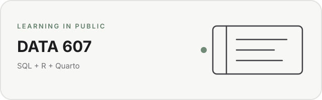

# DATA 607 Data Acquisition and Management

<picture>
  <source media="(prefers-color-scheme: dark)" srcset="assets/readme-card-dark.svg">
  <source media="(prefers-color-scheme: light)" srcset="assets/readme-card-light.svg">
  
</picture>

Fall 2026 coursework for CUNY SPS DATA 607.

I’ll use this repo for assignments, projects, code, and other course files throughout the semester.

## Structure

- `assignments/` for weekly assignments
- `projects/` for course projects
- `final-project/` for final project work

Most of my written work will be in Quarto (`.qmd`) files. I may also publish rendered reports to RPubs or include HTML files when needed for submission.

